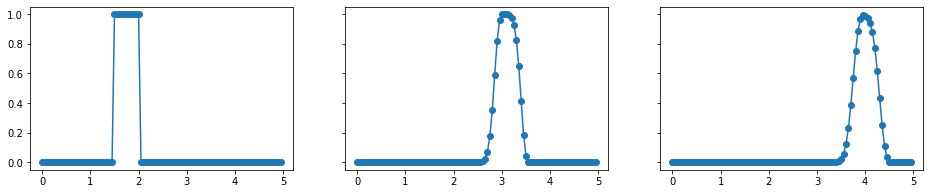

# Wave Equation

A short implementation of primitive finite difference methods to solve one-dimensional advection equation. The solution shows basics characteristics of hyperbolic equations, with insighs, hopefully, transferable to more complex systems.

## Theory:
https://m-tari.github.io/wave_equation/
